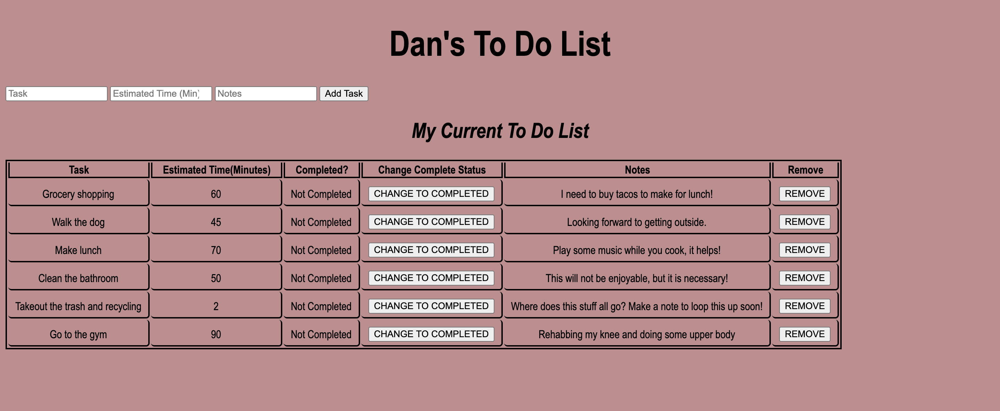
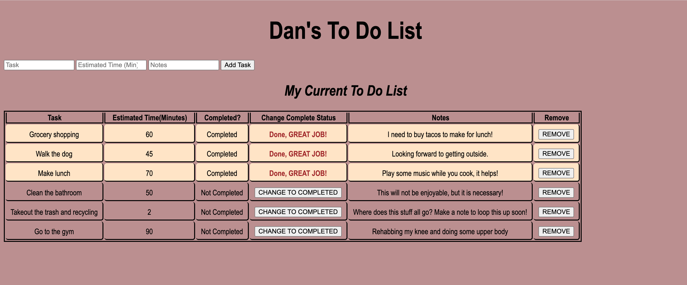

# Full Stack To Do

## Description

_Duration: 3 day Group Sprint_

This web application is able to track a clients personal tasks. The client is able to enter new tasks into the table, mark tasks complete, and delete tasks. There are several inputs the client can use when entering a new task, these include the task name, estimate of minutes it will take, and notes regarding the task. When the task is marked as completed, this is signified with a color change in the task table row.

The developer of this application worked on concise file organization and debugging.  Additionally, the developer. focused on AJAX methodology using GET, PUT, POST, and DELETE requests to communicate between the server and client.

## Screen Shot

Technologies
------------
* JQuery
* Node
* Express
* SQL
* Postico
* PostGres

## Installation

1. Fork this repositiory and clone it on your computer.
2. Open the repository in a code editor like VS Code.
3. Open up your editor of choice and run `npm install` and `npm install body-parser`.
4. Open up Postico and create a new database called `list` and enter the SQL commands in the database.sql file to create a table and insert the data.
5. Run `npm start` in your terminal
6. Go to your browser of choice and enter `localhost:5000` for the URL.

## Usage

The client can use this web application to keep track of their current past, current, or future tasks, mark complete the ones that are done, and add new task to their list.

## Acknowledgement
Thanks to [Prime Digital Academy](www.primeacademy.io) who equipped and helped us to make this application a reality. 

